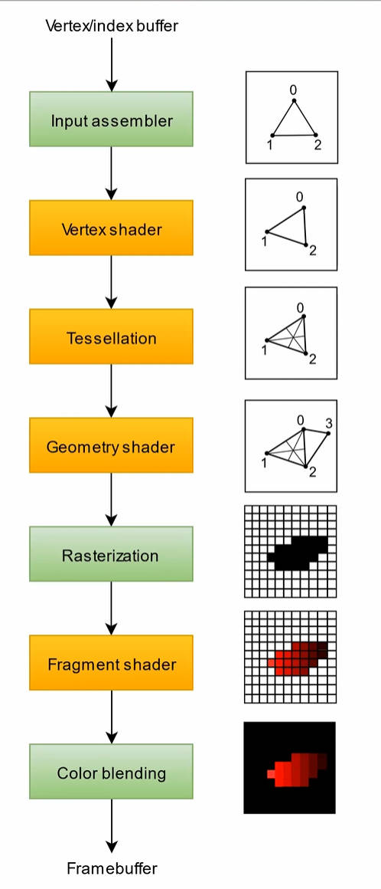

一些基础的概念

<!-- more -->

# Shader与图形渲染

## （一）、基础概念

### 材质（Material）是什么？

一个物体要显示在屏幕上，必须通过一个属于它的材质来实现。材质准确地定义了每个物体在特定情况下显示出来的颜色，比如sprite的默认材质是将图片上每个像素的颜色原封不动的显示出来（也可以自定义一个材质去修改原图片的颜色）。

### 实际上，材质的准确定义是着色器的一个实例，那么着色器（Shader）是什么？

Shader是一个在GPU上面运行的程序（一般的代码是在CPU上运行的），他接受一个物体的形状、颜色等数据，通过一系列的计算来输出每个像素的颜色。

下面介绍一下一个立方体如何从模型数据变成屏幕上的色彩：

1.Shader接收到立方体的顶点、法线等数据。

2.Shader将这些位置转换到屏幕坐标里面。

3.Shader对每个像素进行染色。

4.Shader获取当前光照，计算每个像素受光之后的颜色。

5.Shader将计算好的颜色输出至屏幕。

### 纹理（Texture）又是什么？

Texture就是一张图片，比如人物衣服的颜色。Texture在渲染流程中是Shader中的一个“texture”类型的变量，好比如熟知的float、vector等。

那Shader是怎么显示出木箱上的木纹的？

- ······

- 3.Shader对于每个像素染色。
- 4.Shader读取texture中每个像素的颜色，并将颜色给到**对应**的物体像素上。

### Material的真面目

现在有一个Shader，其中有一个变量是“物体的颜色”，假设现在要用它去渲染五个不同颜色的物体，那需要有五个不同的Shader吗？

显然这样不合理，应该以Shader为模板，去衍生一系列它的实例，然后修改各个实例的颜色即可（就好像创建C#的类的实例）

而根据Shader创建出来的实例就是Material，所以每一个Material背后都有一个Shader，Material只是代表**一个Shader变量的一系列特定值的实例**。

### Material、Shader、Texture的地位一样吗？

这三者其实地位不一样，万物来源是Shader，Material是Shader的一个实例，Texture是Shader的一个变量。

那：

修改Shader，其相关的所有Material都会受到影响吗？

修改一个Material，其相关的Material都会受到影响吗？

显然前者的答案是肯定而后者是否定。

### Unity组件：MeshFilter和MeshRenderer

什么是Mesh？

"mesh"即为网格，主流的3D渲染器讲物体表面分割为一个个三角形进行渲染，整个物体表面是一个三角形的网格，通俗一点，mesh是一个模型的形状。

在Unity3D当中，要显示模型通常需要两个组件：MeshFilter和MeshRenderer

*2D当中只需要SpriteRenderer一个组件就可以了*

MeshFilter是用于处理模型本身的几何信息的（顶点位置，法线位置，切线方向等）

MeshRenderer是用来渲染该模型的（通过某个material）

### Unity的默认材质

如何修改一个3D物体的颜色？

在2D项目中，只需要修改SpriteRenderer中的Color值就可以了，但是3D中并不可以这样更改Unity的默认材质。因为材质是shader的一个实例，所以可以用默认的shader新建一个材质，再修改材质的参数。

#### 参数

1. Rendering Mode（渲染模式）：主要与透明度有关
2. Albedo（反射率）：其实就是颜色
3. Metallic/Smoothness（金属度/平滑度）：定义了与光照的互动强度
4. Normal Map（法线贴图）：用来改变物体的法线，增加细节程度

### Lighting 光照

Unity提供了以下几种光照

1. Directionnal（平行光）：类似“太阳光”，从某个固定的方向以固定的强度照射过来，且覆盖范围是无限的。世界中的所有物体都会平等的受到平行光的照射。一般场景里面只有一个，它的光源的position没有影响，rotation是重要的。

2. Point(点光)：类似“灯泡”，从一点均匀地在一定范围内发出光照，且强度随着距离减弱。显然它的position重要而rotation不重要。

3. Spot（聚光灯）：从一点向一个方向发出圆锥形的光照，且强度随着距离减弱。

4. Area（范围光）：类似有一定面积的LED灯，在一个面积上均匀地发射光线。这是唯一一个非实时光照，需要提前bakery（烘焙）。

### 渲染（Rendering）是什么？

渲染是把物体模型数据转换成屏幕上每个像素的颜色的过程。

### 渲染管线（Rendering Pipeline）

“渲染管线”代表一个特定的物体的渲染过程。

下图是一个标准的渲染管线（橙色的方块是可以编程的部分）。

1. Vertex/index buffer：模型数据（在计算机中“buffer”（缓冲）指的是一块内存空间/一个数组）
2. **Vertex Shader**： 顶点着色器
3. Tessellation：曲面细分（将一个模型细分为由更多顶点的模型）
4. Geometry Shader：几何着色器（对几何数据进行操作，比如添加顶点）
5. Resterization：光栅化（将图像映射到像素空间）
6. **Fragment Shader**：片元着色器
7. Color Blending：处理透明度
8. Frame Buffer：当前帧所有像素的颜色

简单的理解一下渲染过程：

1.  （Vertex Buffer）对于一个模型，收到很多顶点的数据。每个顶点包括位置，法线，颜色等等。 
2.  （Vertex Shader）接着，对每一个顶点执行一段程序。比如“向右移动一个单位”。
3.  （Interpolation）已经完成了顶点的处理，但顶点之间的三角形是由很多像素组成的。需要将这些顶点的数据平 均分配给它旁边的像素。
4. （Fragment Shader）现在对每一个像素执行一段程序。比如“将这个像素染成红色”。
5. 最后，将这些像素的颜色显示在屏幕上。

学习参考：

[Silverjay银鸟工作室个人主页](https://space.bilibili.com/28471795)

[Unity官方文档](https://docs.unity3d.com/cn/2023.2/Manual/UnityManual.html)

