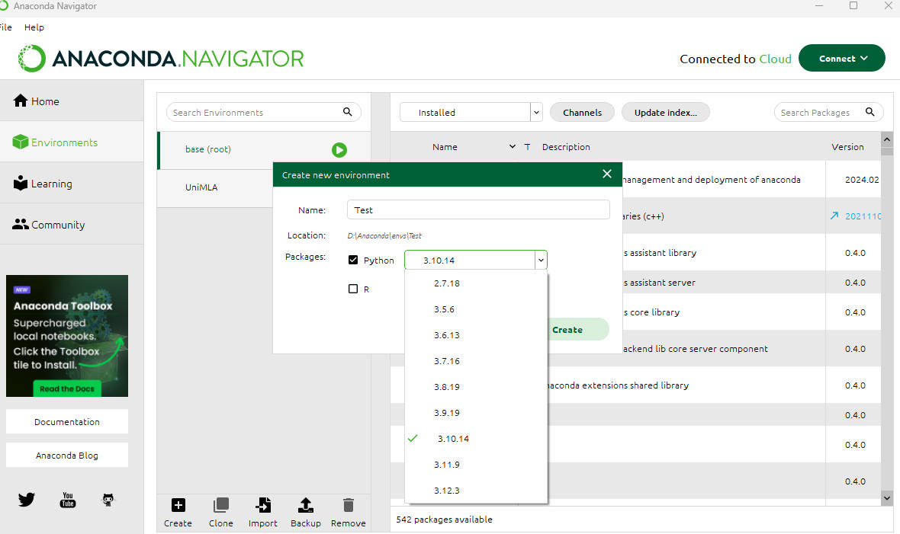
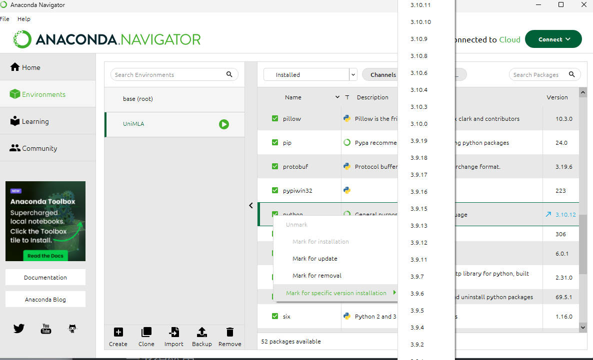
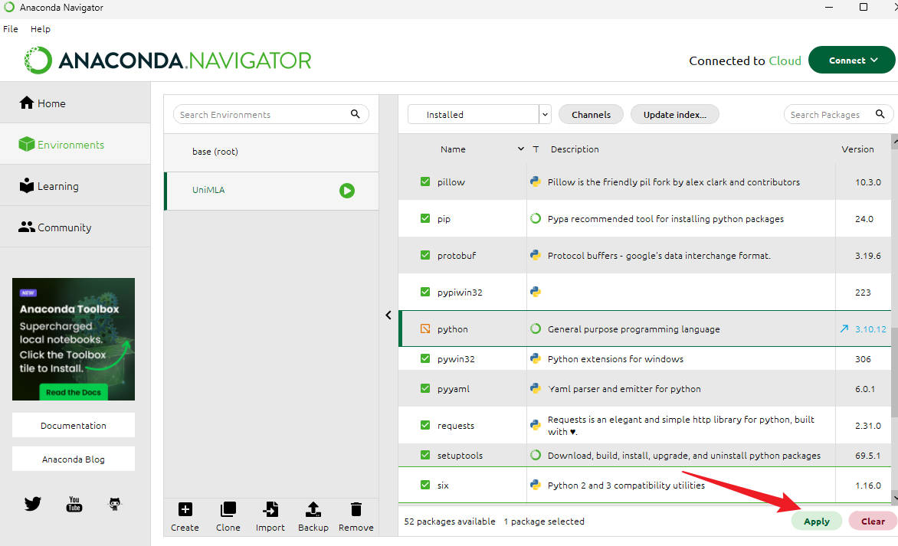

## 下载ML-Agents

到官方Github库下载[Release21](https://github.com/Unity-Technologies/ml-agents/releases/tag/release_21)版本（后续教程均基于此版本），下载完成后解压到本地目录。

## 环境配置

1.安装[anaconda](https://www.anaconda.com/download/)，建议安装完成之后更新到最新版本，否则即使你的anaconda不安装在C盘，创建的环境也会在C盘，且无法修改，在安装过程中务必勾选将anaconda添加到环境变量，安装完成之后，可以在cmd中运行`conda --version`,如果成功输出版本号，则添加成功；如果发生报错，请手动配置环境变量，在控制面板\系统和安全\系统\高级系统设置\环境变量\用户变量\PATH 中添加 anaconda的安装目录的Scripts文件夹。

2.创建虚拟环境，这里有两种方法，一种是使用图形化界面anaconda Navigator ，另一种是使用anaconda Prompt。

### 使用图形化界面anaconda Navigator

启动anaconda Navigator 



如图所示创建一个环境，python版本选择一个靠近3.10.12的版本，创建好之后，请切换python版本到3.10.12，参考下图





### 使用anaconda Prompt

启动anaconda Prompt，输入`conda create -n UniMLA python=3.10.12`

这样就创建了一个名为UniMLA的虚拟环境

3.Win+R，输入cmd，使用cd命令进入ML-Agents解压后的文件夹，比如

`cd /d G:\ml-agents-release_21`(使用/d是为了切换盘符，如果你的ML-Agents文件夹在系统盘，请忽略/d)

然后输入`conda -activate UniMLA`，启动你创建的虚拟环境，成功启动后，cmd新一行会变成`(UniMLA) G:\ml-agents-release_21>`

4.打开文件夹ml-agents-envs，找到文件setup.py，使用诸如VScode之类的软件打开，找到install_requires，把numpy后面的版本号改成1.23.5，保存并退出；打开文件夹ml-agents，找到文件setup.py，同样找到 install_requires，把numpy的那一行改成`"numpy>=1.23.5,<1.24.0"`。

5.回到启用虚拟环境的cmd窗口，依次输入

```Cmd
pip3 install torch -f https://download.pytorch.org/whl/torch_stable.html
pip3 install -e ./ml-agents-envs
pip3 install -e ./ml-agents
```

等待安装完成，如果有报错，请按照提示处理，比如更新pip版本。

*从第三步开始不使用cmd，使用anaconda Prompt过程一致*

之后创建一个Unity项目（Release21版本推荐使用2022.3及以后版本），在packmanager里面选择从磁盘导入包找到`\ml-agents-release_21\com.unity.ml-agents\package.json`导入即可。
