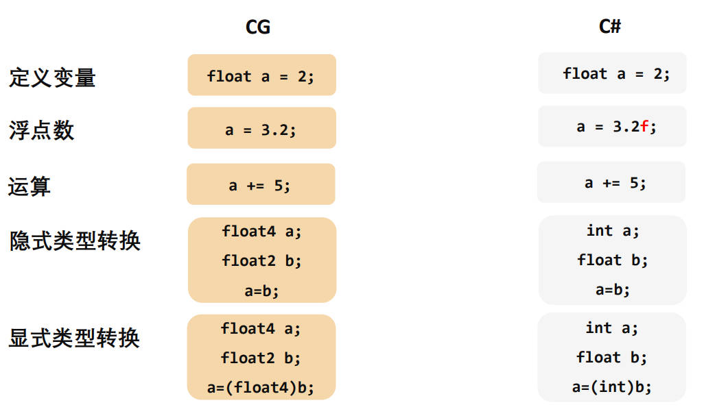

主要是CG语言语法

<!-- more -->

CG语言和C#最大的区别是CG是一个类似“面向过程”的语言（比如C语言），而C#是面向对象的语言。 也就是说在CG中并不存在类、继承、接口、引用类型、new关键字这些概念。它不支持许多较高级的功能，比如泛型、委托、事件、Lambda表达式、隐式类型等等。

# 变量

## 变量类型

基本数据类型：

-  float：单精度浮点数。
-  half：半精度浮点数（范围和精度小于float）。
-  double：双精度浮点数（范围和精度大于float）。
-  int：有符号整数。 fixed：低精度定点数（范围大约为-2到2）。
-  bool：布尔值。

向量数据类型： 

在基本数据类型后接上2、3或4即可表示一个长度为2、3或4的该类型”数组”。

比如float2、float3、float4：分别由2、3或4个float值组成的向量。

## 变量的使用



# 语法

## 循环

和C#一致

## 条件语句

和C#一致，但是在Shader中使用if语句是很浪费性能的行为，除非万不得已不用使用。可以使用step函数实现if语句的功能。

## 函数

定义和调用均和C#一致。

# 向量类型

定义向量类型变量：`类型 名称 = 类型(分量);`（没有new），比如`float2 uv = float2(.1,.5);`

访问其中的一个分量： `向量名.分量名`，比如`uv.x`、`uv.a`

分量名有：x或r（第一个分量）、y或g（第二个分量）、z或b（第三个分量）、w或a（第四个分量）。这些名称是CG语言自 带的，其由来是：xyzw通常用来表示空间坐标，rgba通常用来表示颜色。但在使用上，xyzw和rgba完全没有区别。

访问其中的多个分量： `向量名.几个分量名的组合`

这些分量名的组合可以是2-4之间的任意长度和任意顺序。重复的分量名也是被允许的。

```CG
//eg.
float a = 1.5;
float b = a*2;
float2 ab = float2(a,b);
float2 ba = ab.xy;
float3 baa = float3(ba, a);//一个高维向量可以又几个低维向量组成，比如这里用一个二维向量和一个一维向量定义了一个三维向量
float4 res = float4(5, baa.zyx);
res.a = 0;
//res=(5,1.5,3,0)
```

# 常用数学函数

`sin(x) //x的正弦`   `cos(x) //x的余弦`  `tan(x) //x的正切` `abs(x) //x的绝对值`  `frac(x) //x的小数部分`

`sqrt(x) //x的平方根`  `pow(x,a) //x^a`

`ceil(x) //>=x的最小整数`  `floor(x) //返回<=x的最大整数` `clamp(x,a,b) //如果x>b，返回b,x<a返回a`

`saturate(x) //即clamp(x,0,1)`  `max(a,b) //返回a,b中较大的数`   `min(a,b) //返回a,b中较小的数`

向量相关函数:

`dot(x,y) //x,y的点乘`  `cross(x,y) //x,y的叉乘`   `length(x) //x的长度（模）`  `normalize(x) //标准化x为单位向量`
