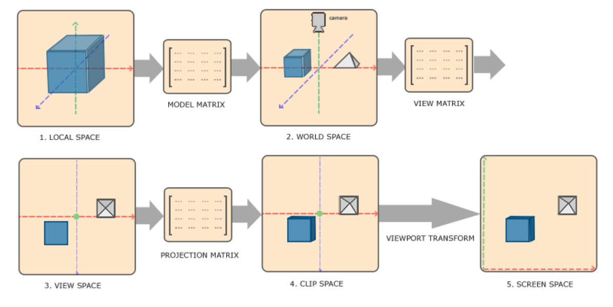
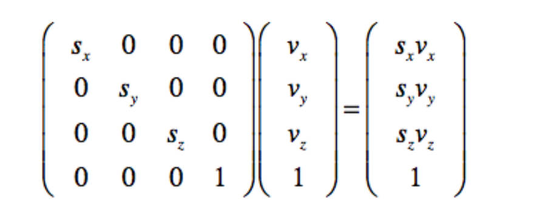
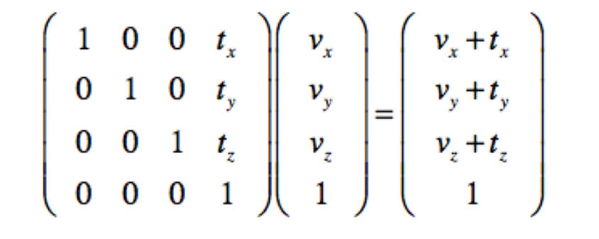
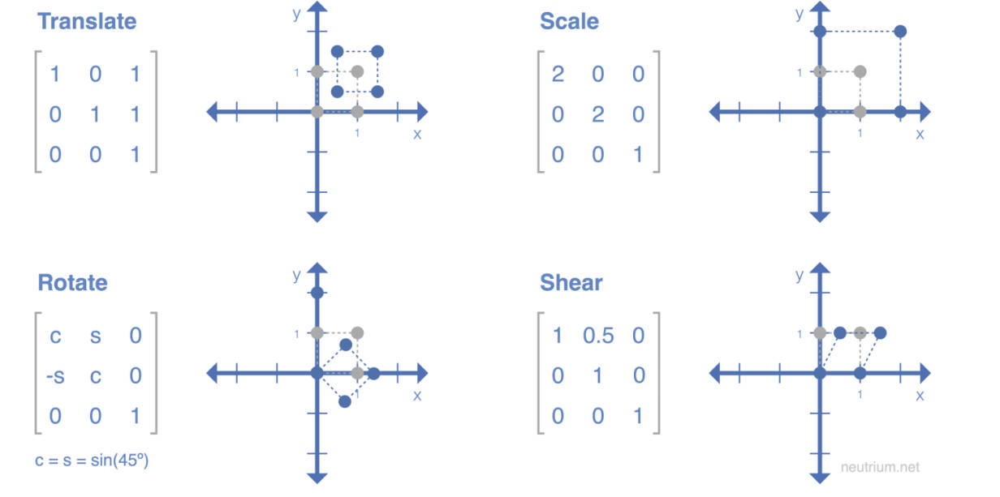
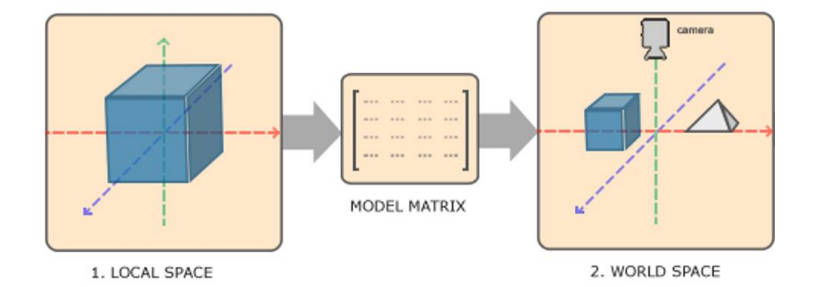
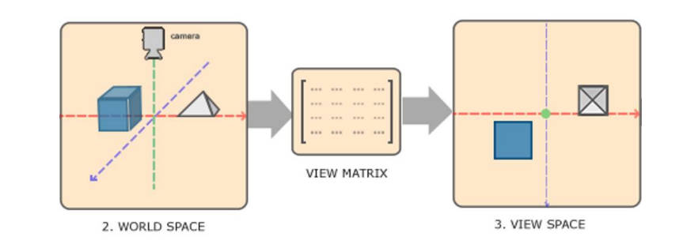
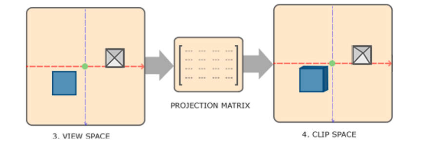

空间变换与Shader结构

<!-- more -->

模型渲染的过程中，首先需要应对的问题是如何把模型数据中的顶点坐标转换为其在屏幕上的坐标。



# 线性代数与空间变换

## 变换矩阵

可以将点的坐标和一个矩阵相乘得到该点变换过后的坐标。



上方左侧的矩阵就是一个“scaling”（缩放）矩阵。它会使一个物体从坐标原点放大。一个变换矩阵的每一列代表着变换之后其对应坐标轴的单位变化。 比如原本x坐标轴的一个单位是(1,0,0,0)，而上方矩阵的第一列为(sx,0,0,0)，所以上方矩阵的“含义”是将x坐标轴的一个单位放 到(sx,0,0,0)的位置上。这样就相当于在x轴方向“缩放”了sx倍。

### 齐次坐标 Homogeneous Coordinates

变换矩阵总是会多一个维度。2D变换矩阵的大小是3x3， 而3D变换矩阵的大小是4x4。多出一个分量的坐标叫做“齐次坐标”。

齐次坐标允许我们将位移用变换矩阵表示出来:



位移、缩放、旋转、变形等等操作都可以用一个矩阵来表示。下方是2D变换矩阵的例子:



### 变换矩阵的复合

如果想对一个物体进行复合的变换，只需将这些变换的矩阵从左到右分别乘起来得到一个复合变换矩阵就可以。 比如：先将一个物体位移到A（矩阵为M1），再旋转B（矩阵为M2），只需左乘（M1*M2）这个复合矩阵就好。

可以把一个物体的所有自身变换（位移、旋转、缩放）放在一个矩阵里。 这个矩阵被称为模型矩阵（Model Matrix）。

## MVP空间变换

### Model Transformation

在空间变换的第一步，需要把模型坐标转换为世界坐标。



模型坐标是以模型自身中心为原点的坐标，而世界坐标是以世界中心为原点的坐标。在这一步中，将模型的每一个顶点位置乘以其Model Matrix。 这样，模型就拥有世界中的位置、旋转、与大小了。

### View Transformation

在空间变换的第二步，需要把世界坐标转换为视角坐标（或相机坐标）。



视角坐标（或相机坐标）是以相机自身中心为原点，且Z轴指向相机方向的坐标系。在这一步中，将模型的每一个顶点位置乘以相机的View Matrix。 这样，就可以从相机的视角看向物体了。

### Projection Transformation

在空间变换的第三步，需要把相机坐标转换为剪裁坐标。



剪裁坐标是以相机自身中心为原点，且具有投影的坐标系。投影分为两种：**正交投影**（Orthographic Projection） 和**透视投影**（Perspective Projection）。

在这一步中，将模型的每一个顶点位置乘以相机的Projection Matrix。 这样，就拥有一个正确显示在屏幕上的物体了。

Model Matrix、View Matrix和Projection Matrix当然也可以复合，只要把这三个矩阵从左到右相乘，就可以得到一个MVP Matrix。它能将一个点从模型空间直接变换至剪裁空间。以上的MVP变换，其实就是**Vertex Shader**（顶点着色器）的主要工作。

在Unity的vertex shader中，可以通过这个语句完成MVP变换：`o.vertex = mul(UNITY_MATRIX_MVP, v.vertex)`mul是矩阵乘法函数

# Unity Shader结构

- Properties：公开在引擎面板上的，可以在引擎里直接修改的变量 
- SubShader: shader的内容 
- Tags：一些可以设定的属性 
- Pass：一次渲染周期（vert+frag shader）。这是shader的主体代码。

```clike
Shader "Unlit/myShader"
{
    Properties//这是面向引擎的
    {
        //这是Unity自己的语言既不是CG也不是C#
        _MainTex ("Texture", 2D) = "white" {}
        _Color ("Color", Color) = (1,1,1,1)
        _Cutoff ("Alpha Cutoff", Range(0,1)) = 0.5           
        //结构是：shader中的变量名（"在引擎当中显示的名字"，变量类型）=初始值（句末没有“;”）
        //这里面的变量完完全全只是面向引擎的，如果不相应的在下面的SubShader部分中定义一个相同的变量（“相同”指的是变量名和变量类型均相同），只通过更改引擎中的上面变量的值，不会对这个Shader产生任何影响，比如说你更改了_Color的值，改变了颜色，但是物体的颜色并不会改变
    }
    SubShader//这是真正的Shader的内容
    {
        Tags { "RenderType"="Opaque" }
        LOD 100

        Pass
        {
            CGPROGRAM//下面才是CG语言
            #pragma vertex vert//定义vertex shader 部分的函数叫"vert"，和下面对应
            #pragma fragment frag//定义fragment shader 部分的函数叫"frag"，和下面对应
            // make fog work
            #pragma multi_compile_fog//后面再了解

            #include "UnityCG.cginc"//类似C++的头文件，C#的using

            struct appdata
            {	
                //:后面是语义 semantics，为了“告诉”电脑前面的变量是什么
                float4 vertex : POSITION;////模型顶点位置，从mesh组件获取
                float2 uv : TEXCOORD0;//模型顶点uv，uv就是模型上每个顶点带的一个用于决定在贴图中定位像素点的坐标。
                //TEXCOORD0:texture coordinate 0
            };

            struct v2f//vertex to fragment
            {
                float2 uv : TEXCOORD0;//模型顶点uv
                UNITY_FOG_COORDS(1)//后面再了解
                float4 vertex : SV_POSITION;//模型顶点位置
                //system value 其实就是模型在剪裁空间的位置，传给电脑
            };
		//定义Shader内部的变量，但是变量类型必须写明是什么，上面_Cutoff ("Alpha Cutoff", Range(0,1)) = 0.5  这个变量的类型写的是Range(0,1)，但是CG语言里面没有Range(0,1)，在这里必须写
            //float _Cutoff;
            //sample2D _MainTex;
            //fixed4 _Color;    只有有这样一句定义，我们才能通过在引擎里面更改颜色达到更改物体颜色的效果，Unity才会把写的变量连接起来
            sampler2D _MainTex;
            float4 _MainTex_ST;

            v2f vert (appdata v)
            {
                v2f o;//定义一个v2f类型的变量
                o.vertex = UnityObjectToClipPos(v.vertex);
                //完全可以写成o.vertex = mul(UNITY_MATRIX_MVP,v.vertex);
                //UnityObjectToClipPos是新版本Unity新提供的封装好的api
                //本质上就是实现了一次MVP变换
                o.uv = TRANSFORM_TEX(v.uv, _MainTex);
                UNITY_TRANSFER_FOG(o,o.vertex);
                return o;
            }

            fixed4 frag (v2f i) : SV_Target//像素值的语义，不写这个语言颜色就不能正确地返回到模型上了
            {
                //可以写任何的颜色变换
                // sample the texture
                fixed4 col = tex2D(_MainTex, i.uv);//后面再了解
                // apply fog
                UNITY_APPLY_FOG(i.fogCoord, col);//后面再了解
                return col;
                //如果在这里return一个上面定义的颜色变量，那么就可以做到在编辑器里面实时更改物体颜色
            }
            ENDCG//CG语言部分结束
        }
    }
}
```

