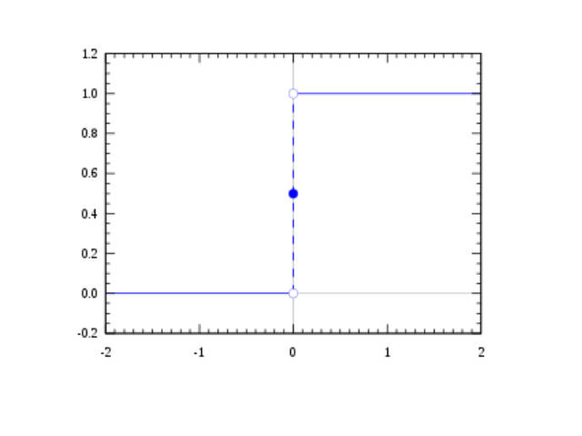
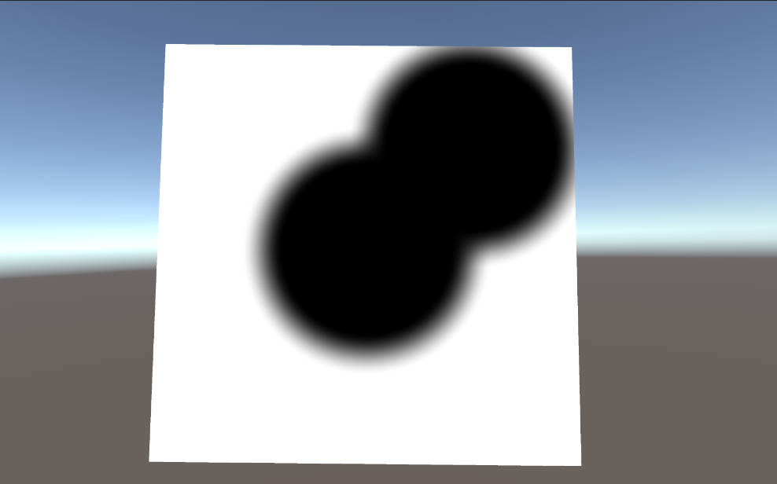
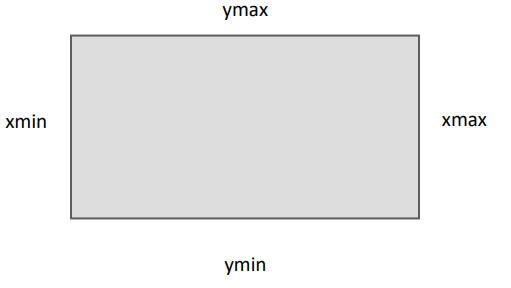
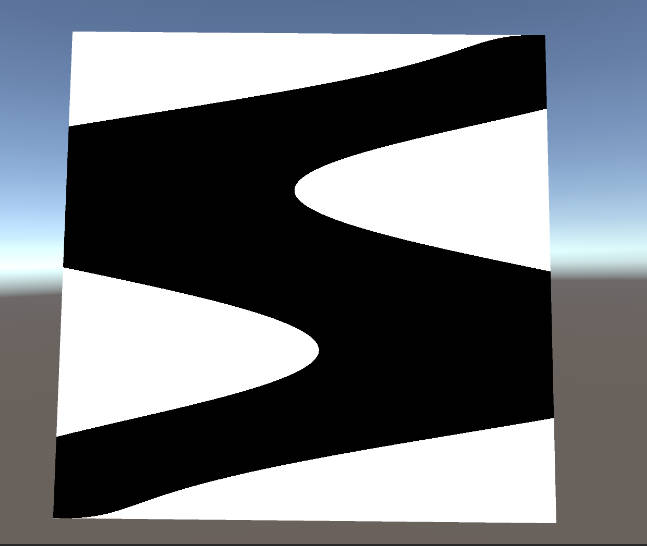
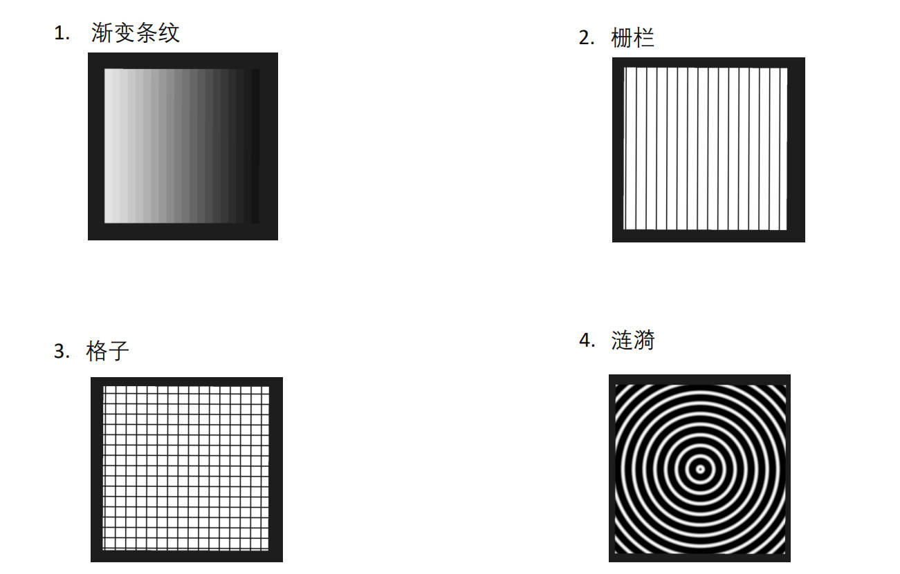
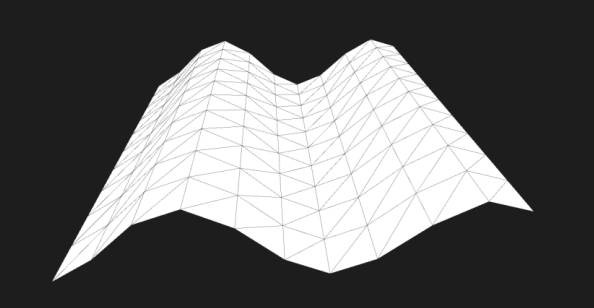

颜色、形状、动画

如何在Shader中创建颜色和形状，实现动画效果，屏幕后处理

<!-- more -->

# 颜色

## 色彩空间 Color Space

表达颜色的方式可以有很多种。比如最常见的RGB颜色，以及加入加入透明度（alpha）的RGBA颜色


以及通过色彩（Hue）、饱和度（Saturation）和明度（Brightness）表示的HSV颜色：


## 颜色的属性

- 明度（brightness/value）：与同样亮的白色物体相比，某物的亮的程度。 
- 亮度/辉度（luminance）：发光或反射光的强度。也就是黑白照片中每个颜色的明度。
- 饱和度（saturation）：鲜艳程度。也就是【1 - 与该颜色的亮度的距离】。
- 对比度（contrast）：1 - 与灰色(0.5,0.5,0.5)的距离。
- 透明度（transparency）：一种该颜色alpha值的表现形式。Alpha值只不过是一个数字，它并不一定需要表示透明度。

直接对一个颜色乘以一个数，改变的是颜色的明度。

## 颜色的混合

在图形渲染中，并不局限于使用颜料混合（乘法）或光学混合（加法）。

`C = A * B   C = A + B    C = A – B    C = (A + B)/2`

## 使用shader进行屏幕后处理

在拥有了在shader中处理颜色的能力后，就能够把当前帧的画面拿下来并在上面做任想做的操作了，可以使用以下的方法将自己的shader应用在相机上：

```c#
private void OnRenderImage(RenderTexture source, RenderTexture destination)
{
	Graphics.Blit(source, destination, mat); //mat是shader的材质
}
//在脚本里面要定义一个Material类型的变量
```

如何实现马赛克化效果？

```clike
//In fragment shader
flaot size=10;//马赛克大小
i.uv=floor(i.uv*size)/size;//取uv坐标的整数部分，挤压数据
```

# 形状

## step函数

在shader中应该尽量避免使用if-else语句。这是因为if-else语句在GPU这种多并行的架构上会拖慢性能。

几乎可以使用step函数代替所有的if-else语句，`step(a,x)`

step函数很简单：接受两个参数a、x，当x>=a时返回1，否则返回0。下面是step(0,x)的函数图像。



```clike
//要实现“一个长方形的左半边为红色，右半边为蓝色”的shader效果，可以这么写
if(uv.x<0.5)
	color = fixed4(1,0,0,1);
else
	color = fixed4(0,0,1,1);
//使用step函数的话，它会变成这样：
float isLeft = step(0.5,x);
color = lerp(fixed4(1,0,0,1), fixed4(0,0,1,1), isLeft);
```

## smoothstep函数

step函数会造成许多硬边。这时就需要smoothstep函数来解决这个问题了。

`smoothstep(a,b,x) ` 当x>=b时，返回1；当x<=a时，返回0；否则根据x的值返回一个a、b之间的平滑过渡。

下图是smoothstep(-0.5,0.5,x)的图像。


通常情况下都可以用smoothstep函数代替step函数来实现平滑的边缘过渡

`step(0.5, x)`可以变成`smoothstep(0.49, 0.51, x)`

另外，`smoothstep(a,b,x) = 1 – smoothstep(b,a,x)`

## 在shader中绘制圆形

圆形是最简单的一种：它的定义是“和一点距离在一定范围内的所有点的集合”。

可以使用uv坐标来计算每一个像素点和圆形的中心点的距离，并只绘制距离小于半径的点：

```clike
float cirle(float2 uv,float2 pos,float radius ,float s)
{
    float len=length(uv-pos);
    return smoothstep(radius-s,radius+s,len);
}
fixed4 frag (v2f i) : SV_Target
{
    // sample the texture
    fixed4 col = tex2D(_MainTex, i.uv);
    // apply fog
    UNITY_APPLY_FOG(i.fogCoord, col);                            
    i.uv=i.uv*2-1;//保证uv的范围是[-1,1]，而非[0,1]。（这是为了保证(0,0)在中心）
    float c1=cirle(i.uv,float2(0,0),0.5,0.1);
    float c2=cirle(i.uv,float2(0.5,0.5),0.5,0.1);
    col*=c1*c2;//创建的圆形是中间的值为0，外围的值为1的形状。可以使用乘法将多个形状绘制到物体上。
    return col;
}
//
```



## 在shader中绘制矩形

矩形由xmin, xmax, ymin, ymax四个值定义；一个矩形即是所有在这 个范围内的点的集合。



可以使用四个smoothstep函数来分别处理这四个值

```clike
float rect = smoothstep(xmin, xmin+0.01, uv.x);  
rect *= smoothstep(xmax+0.01, xmax, uv.x); //注意这里的参数次序！大的值在先，小的在后（为什么？）
//左边是黑色还是右边是黑色的问题，两个边界的左右颜色顺序是相反的
//现在已经在x轴上处理好了，接着在y轴上做同样的事情：
rect *= smoothstep(ymin, ymin+0.01, uv.y);  
rect *= smoothstep(ymax+0.01, ymax, uv.y);
```

```clike
//eg.
fixed4 frag (v2f i) : SV_Target
{
    // sample the texture
    fixed4 rect = tex2D(_MainTex, i.uv);
    // apply fog
    UNITY_APPLY_FOG(i.fogCoord, col);                            
    i.uv=i.uv*2-1;
    col*=step(-0.5,i.uv.x);
    col*=step(i.uv.x,0.5); 
    col*=step(-0.5,i.uv.y);
    col*=step(i.uv.y,0.5);
    return rect;
}
```

## UV变换

UV变换是一种很通用的技巧。如果把UV想象成一个二维空间的话，可以通过UV变换来任意扭曲这个空间。

`col*= circle(i.uv, float2(0,0),0.2, 0); //画一个半径为0.2的圆`

`col*= circle(i.uv*5, float2(0,0),0.5, 0); //这样会怎么样？` 圆会变小，相当于相机往外拉了


i.uv.x+=sin(i.`i.uv.x=sin(i.uv.y*10);`




如何实现下面四幅图中的效果？



```clike
//1. In fragment shader
i.uv=floor(i.uv*10)/10;
col*=i.uv.x;
//实现渐变=>马赛克化

//2. In fragment shader
//col*=sin(i.uv*50);黑白均匀版
//col*=step(0.9,sin(i.uv.x*100));//白色会变小
col*=1-step(0.9,sin(i.uv.x*100));//黑白反色

//3. In fragment shader
//xy两个方向叠加2的效果
col*=1-step(0.9,sin(i.uv.x*100));
col*=1-step(0.9,sin(i.uv.y*100));

//4. In fragment shader
i.uv=i.uv*2-1;
col*=step(0.99,sin(length(i.uv)*100));
```

# 时间与动画效果

动画的核心是时间。在Unity shader中，可以通过_Time来访问当前的运行时间。

Time是一个float4，它的分量分别为(t/20, t, t2, t3)。一般使用`Time.y`来获取时间。

`col*=smoothstep(0.4,0.6,sin(length(i.uv)*30+_Time.y));`


`col*=smoothstep(0.4,0.6,sin(length(i.uv)*30+sin(_Time.y)));//这样是来回的效果`

再加上`col*=lerp(fixed4(1,0,0,1),fixed4(0,0,1,1),sin(_Time.y)/2+0.5);`会有这样的效果


变成`col*=lerp(fixed4(1,0,0,1),fixed4(0,0,1,1),sin(_Time.y*length(i.uv))/2+0.5);`就会变成依赖距离变化的效果

`fixed4 color = fixed4(abs(sin(_Time.y)), 0, 0, 1);//一个在红色和黑色不断过渡的颜色动画`

`uv.y += sin(uv.x * 25 + _Time.y) * .1;//是一个“流动”效果的UV动画`

`float c = circle(uv, float2(cos(_Time.y),sin(_Time.y)), .2);一个圆绕一个隐形的圆转动`


动画也可以用在vertex shader里：

`v.vertex += sin(_Time.y);`

比如波浪效果的一种实现就是在vertex shader里使用动画调整每个顶点的高度：

`v.vertex.y += sin(_Time.y + v.vertex.x)；`


