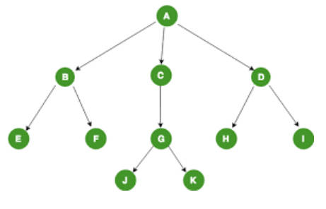
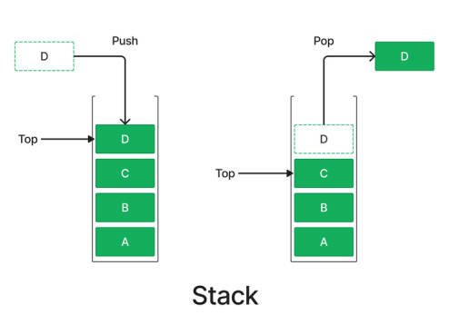
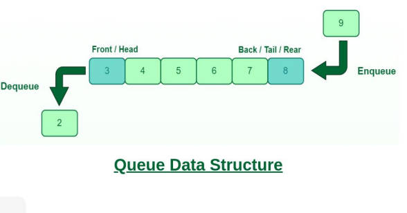

Unity协程原理、基础的数据结构知识，还有一点图算法（DFS和BFS）

<!-- more -->

## 协程、枚举器、迭代器

### 枚举器接口 IEnumerator

枚举器接口提供了一种通用的遍历集合的方法。比如当我们使用foreach循环时其实就是使用了一个IEnumerator。

```c#
public interface IEnumerator
{
    bool MoveNext(); // 前进至下一个元素
    object Current { get; } // 获取当前元素,只读属性保证不会更改集合中的元素
    void Reset(); // 重置回第一个元素
}	
//泛型版本
public interface IEnumerator<T> : IEnumerator
{
    bool MoveNext();
    new T Current { get; }
    void Reset();
}
```

IEnumerator由三个成员组成，其中MoveNext()和Current是其核心。 

大概的步骤是： 1. 我们拿到一个集合（array、list、etc.） 2. 获取一个该集合的枚举器 3. 使用Current访问当前元素并用MoveNext()移至下一个元素，直到遍历完成。

### 可被枚举接口 IEnumerable

仅仅是代表“可被枚举”这个特性。

```c#
public interface IEnumerable
{
	IEnumerator GetEnumerator();
}
```

IEnumerable意味着什么？

可以获取一个它的枚举器=>可以通过该枚举器遍历其中的元素=>可以使用foreach循环遍历其中的元素。

*熟知的C#自带的数据结构大多都是IEnumerable的，包括 Array、List、Dictionary、Stack、Queue等等*

### 枚举器的使用

```c#
IEnumerable<int> sequence = new List<int> { 1, 2, 3, 4, 5 };
IEnumerator<int> enumerator = sequence.GetEnumerator();
while (enumerator.MoveNext())
{
    int current = enumerator.Current;
    print(current);
}
```

枚举器就像一个依次指向了集合中的各个元素。

### 迭代器 Iterator

迭代器是一种结构（或设计模式）。迭代器允许我们自定义一个枚举器的行为。

```c#
public IEnumerable<int> GetNumbers()
{
    for (int i = 1; i <= 5; i++)
    {
        yield return i;
    }
}
//返回IEnumerable<int>，但是没有return语句，更不论根本没有创建一个IEnumerable<int>类型的对象了
```

### Iterator和yield

在一个返回`IEnumerable`的函数中使用`yield`关键字时，系统会帮我们自动生成一个继承自`IEnumerable`的类，并在该类中实现我们所写的逻辑。（包括`MoveNext()`等方法）

这个类它会记录当前迭代的状态，包括本地变量的值与迭代器在集合中的位置；它会把`yield return x`翻译成“将`Current`设为x，记录当前的状态，并暂停执行”这一系列操作。

yield return具体的功能： 1. 将内部枚举器的Current设为一个值（或者说“提供枚举器的下一个值”） 2. “暂停函数的执行”，并且在下一次执行该函数时从yield return的位置开始（而非从头开始）

```c#
//eg.Form Microsoft
var numbers = ProduceEvenNumbers(5);
Console.WriteLine("Caller: about to iterate.");
foreach (int i in numbers)
{
    Console.WriteLine($"Caller: {i}");
}

IEnumerable<int> ProduceEvenNumbers(int upto)
{
    Console.WriteLine("Iterator: start.");
    for (int i = 0; i <= upto; i += 2)
    {
        Console.WriteLine($"Iterator: about to yield {i}");
        yield return i;
        Console.WriteLine($"Iterator: yielded {i}");
    }
    Console.WriteLine("Iterator: end.");
}
// Output:
// Caller: about to iterate.
// Iterator: start.
// Iterator: about to yield 0
// Caller: 0
// Iterator: yielded 0
// Iterator: about to yield 2
// Caller: 2
// Iterator: yielded 2
// Iterator: about to yield 4
// Caller: 4
// Iterator: yielded 4
// Iterator: end.
```

*IEnumerable是一个声明式的接口，声明实现该接口的Class是“可枚举（Enumerable）”的，但并没有说明如何实现枚举器（iterator）；IEnumerator是一个实现式的接口，IEnumerator object就是一个iterator。*

*IEnumerable和IEnumerator通过IEnumerable的GetEnumerator()方法建立了连接，Client可以通过IEnumerable的GetEnumerator()得到IEnumerator object，在这个意义上，将GetEnumerator()看作IEnumerator object的Factory Method也未尝不可。*

### 协程的原理

Unity中的协程利用了迭代器的机制实现了**“执行一系列操作”**而非**“遍历一个集合”**的功能。关键点在于：在这里一个协程中的**“集合”**就是所有yield return的返回值，比如{null, new WaitForSeconds(5)}就是下方协程的集合。当我们在遍历这个集合时，所有真正有用的语句都会一并被执行。

```c#
IEnumerator MyCoroutine()
{
    //真正有用的语句
    yield return null;
    //真正有用的语句
    yield return new WaitForSeconds(5);
}
```

在调用`StartCoroutine()`函数来执行协程时，其实是在做这几 件事： 1. 每一帧调用MoveNext()，这样可以执行协程直到遇到yield return 2. 通过yield return返回的Current值，做一系列特定的操作。

所以只有写`yield return null;`才会延迟到下一帧执行吗？可以写一段伪代码来看看`StartCoroutine()`的原理是什么。

```
void MyStartCoroutine()
{
	Update//每一帧都执行
	{
        MoveNext();
        if(Current is WaitForSeconds)
        {
        	Stop for x seconds;//具体逻辑可能就是我们写的一个简单的计时器，timer=time+=Time.dealtTime这样
        }
        else if(Current is WaitFixedUpdate)
        {
        	Stop for fixedupdate;
        }
        else
        	//···
	}
}
```

所以我们如果在`yield return`后面写一个`new GameObject();`编译器也不会报错，这些奇奇怪怪的返回类型根本在`StartCoroutine()`里面没有对应的情况，所以它不会执行特定的操作，依然默认间隔一帧，然后执行`MoveNext()`，甚至写`new GameObject();`，确实会把`Current`的值设置为新实例化一个GO，场景里面真的会出现新的GO。

所以写`yield return null;`只是为了不发生奇奇怪怪的事，并非它是特定的延迟一帧。

## 数据结构

### 多维数组

#### 一般的多维数组

在C#中，我们可以使用[,]来定义多维数组。定义数组的时候一定要写明数组的大小。

比如`int[,] grid = new int[5,5];`

遍历多维数组：

```c#
for(int i = 0; i < grid.GetLength(0); i++)
{
     for(int j = 0; j < grid.GetLength(1); j++)
     {
     	grid[i, j] = 0
     } 
 }
//GetLength(n)代表数组第n维的长度。
```

#### 交错数组

交错数组是大小不完全决定好的，“锯齿形”的一种数据结构。可以使用`[][]`来定义交错数组。`int[][] arr = new int[5][];`

第一个维度的大小要提前定义，而其他维度的大小不可以提前定义,可以把这个数组看成数组的数组。所以交错数组是**一系列不一样长的数组**的数组。行数是确定的，而列数不确定，所以是锯齿形。

交错数组中的子数组是未初始化的，需要手动初始化。

### 树 Tree

树是一种由根节点和叶节点组成的数据结构。比如游戏中常见的“技能树”就是一种树。



```c#
class TreeNode
{
    public float value;
    public List<TreeNode>() children = new List<TreeNode>();
}
```

只需要访问根节点（最上方的节点）就可以遍历整个树结构了。

```c#
void Traversal(TreeNode root)
{
    print(root.value);
    foreach(var child in root.children)
    Traversal(child);
}
```

树其实是有向图的一种。它允许我们表示物体之间的依赖 /层级关系。 C#的GC的标记算法就是使用了树结构。

### 栈 Stack

栈是一种像盒子一样，数据先进后出的一种数据结构。 简单来说，数据们依次堆在盒子里，在上方没有物体时我们才可以对一个数据进行操作。和内存中的Stack是一个东西。



栈结构通常具有三个主要的操作：

`void Push(object obj) //将物体放在栈顶` 

`object Pop() //将栈顶的物体移除并返回`

`object Peek() //返回栈顶的物体`

C#也提供了一个泛型的栈 `private Stack stack = new Stack();`

### 队列 Queue

队列是一种像隧道一样，数据先进先出的一种数据结构。（和栈相反） 数据们依次排在隧道里，只可以对一个在隧道出口的数据进行操作。



队列结构通常具有三个主要的操作：

`void Enqueue(object obj) //将物体放在队尾` 

`object Dequeue() //将队头的物体移除并返回`

`object Peek() //返回队首的物体`

C#也提供了一个泛型的栈 `private Queue<int> queue = new Queue<int>();`

*以下这些场景中，应该选择使用哪种数据结构呢？*

*在游戏中我们会打开许多叠放在彼此之上的UI界面，我们想让玩家只对显示在**最上方**的界面做出输入。*——Stack

*当玩家获得一个新物品时，一个（仅有一个）小窗口会用来显示新物品的信息，并在5秒后消失。问题是如果玩家在5秒 内获得了多个新物品时，我们需要按顺序在这个小窗口内依次显示这些物品的信息。*——Queue

*飞船的科技发展是由多个分支组成的，每个分支中的升级需要依次解锁。*——Tree

## 图算法及其应用

假设一个NxN的二维数组代表一个五子棋棋盘。数组中的每个元素代表其中的棋子：0代表空，1代表白棋，2代表黑棋。 那么，如何判断一个棋盘中是否有一方获胜（五子连成一线）呢？

### 深度优先搜索 Depth-First Search

从每一个非零的位置开始向8个相邻的位置“发一条射线”，如果遇到了5个一样的棋子则判断成功；如果 所有非零的位置都不符合条件，则判断失败。这就是DFS。

DFS只是做了两件事： 1. 选一个方向一路走到底 2. 遇到死路了就回到上一个路口换个方向继续

```c#
void DepthFirstSearch(TreeNode root)
{
    if (root == null) return; 
    root.visited = true;
    foreach (var child in root.children) 
    {
        if (!child.visited)
        {
            DepthFirstSearch(child);
        }
    }
}
//是一个通用的DFS模板。在不断“向深处探索”的时候也要标记出已经访问过的节点，防止走重复的路。
```

### 广度优先搜索 Breadth-First Search

BFS更像是“一层层前进”。它不会一条路都走到底，而是对每条路慢慢试探直到碰到终点为止。

对于五子棋的例子，BFS也可以解：与其在每个方向上走到底，每次都在所有的方向上向前走一步，直到有任一方向走了 五步为止。

```c#
void BreadthFirstSearch(Node root) 
{
    Queue<Node> queue = new Queue<Node>();//创建一个队列 queue，用于存储待访问的节点。
    root.visited = true;//将根节点root标记为已访问
    queue.enqueue(root);//将根节点加入队列
    while (!queue.isEmpty()) //只要队列不为空
    {
        Node node = queue.dequeue();//从队列中取出队首节点 node。
        foreach (var child in node.children) //遍历该节点的所有子节点
        if (!child.visited)
        {
            child.visited = true;
            queue.enqueue(child);//将该子节点加入队列=>再从该子节点开始遍历该子节点的子节点，一层层深入
        }
    }
}
//这是一个通用的BFS模板。注意到使用了一个Queue来代表目前正在探索的节点。这是因为Queue的先进先出的特性
```

对于以下的场景，我们应该使用BFS还是DFS呢？

一个地图是由NxN的方格构成的。玩家在其中一个方格向四周5x5的方形区域内进行了一次范围攻击，我们该如何得到被 攻击到的所有敌人？——BFS

如何判断一个物体的所有子物体中有没有名为“Box”的物体？（注意，这里的“所有子物体”不仅指其直接的子物体，也包 括其子物体的子物体等等……） ——DFS

如何在一个NxN的迷宫中找到从起点到终点的一条路径？那最短路径呢？——DFS/BFS、BFS

```c#
//这个使用DFS写的五子棋输赢判断
using System;
public class Gomoku
{
   private const int BoardSize = 15;
   private static int[,] board = new int[BoardSize, BoardSize];
   public static bool CheckWin(int row, int col, int player)
{
    int[,] directions = {
        { 0, 1 },   // 水平方向
        { 1, 0 },   // 竖直方向
        { 1, 1 },   // 正斜线方向
        { 1, -1 }   // 反斜线方向
    };

    for (int i = 0; i < 4; i++)
    {
        int count = 1;
        int dr = directions[i, 0]; // 行偏移量
        int dc = directions[i, 1]; // 列偏移量
        // 向当前方向搜索
        for (int j = -1; j <= 1; j += 2)//-1和1切换表示向前搜索和向后搜索
        {
            int r = row + dr * j; // 开始搜索的行号
            int c = col + dc * j; // 开始搜索的列号
            
            // 搜索相同棋子数量
            while (r >= 0 && r < BoardSize && c >= 0 && c < BoardSize && board[r, c] == player)
            {
                count++;
                r += dr;
                c += dc;
            }
        }        
        if (count >= 5)
        {
            return true;
        }
    }
    return false;
}
    public static void Main(string[] args)
    {
        // 初始化棋盘，0表示空格，1表示玩家1的棋子，2表示玩家2的棋子
        // 调用 CheckWin 方法检查玩家1是否获胜
     }
}

//这是BFS算法
using System.Collections.Generic;
public class Gomoku
{
    private const int BoardSize = 15; // 棋盘大小
    private static int[,] board; // 棋盘
    public static bool CheckWin(int row, int col, int player)
    {
        board = new int[BoardSize, BoardSize]; // 初始化棋盘
        // 在这里假设已经将棋盘上的棋子状态存储在board数组中，0表示空格，1表示白子，2表示黑子
        int[,] directions = {
            {0, 1},   // 水平方向
            {1, 0},   // 竖直方向
            {1, 1},   // 正斜线方向
            {1, -1}   // 反斜线方向
        };
        // 以当前位置为起点，分别向四个方向进行广度优先搜索
        for (int i = 0; i < 4; i++)
        {
            int count = 1; // 记录连续相同棋子的数量
            Queue<(int, int)> queue = new Queue<(int, int)>(); // 用于广度优先搜索的队列
            queue.Enqueue((row, col)); // 将起点加入队列
            bool[,] visited = new bool[BoardSize, BoardSize]; // 记录已访问过的位置
            while (queue.Count > 0)
            {
                var (r, c) = queue.Dequeue(); // 出队一个位置
                visited[r, c] = true; // 标记为已访问
                // 在当前位置的四个方向上继续搜索
                for (int j = 0; j < 4; j++)
                {
                    int dr = directions[j, 0]; // 行增量
                    int dc = directions[j, 1]; // 列增量
                    int nr = r + dr; // 计算下一个位置的行号
                    int nc = c + dc; // 计算下一个位置的列号
                    // 判断下一个位置是否合法且未访问过
                    if (nr >= 0 && nr < BoardSize && nc >= 0 && nc < BoardSize && !visited[nr, nc] && board[nr, nc] == player)
                    {
                        count++; // 连续相同棋子数量加一
                        queue.Enqueue((nr, nc)); // 将下一个位置加入队列
                    }
                }
            }

            if (count >= 5)
            {
                return true; // 如果连续相同棋子数量达到5个或以上，则返回true，表示当前玩家获胜
            }
        }
        return false; // 如果所有方向上都没有连续相同棋子数量达到5个以上，则返回false，表示当前玩家未获胜
    }
    public static void Main(string[] args)
    {
        // 初始化棋盘，0表示空格，1表示玩家1的棋子，2表示玩家2的棋子
        // 调用 CheckWin 方法检查玩家1是否获胜
     }
}

```

