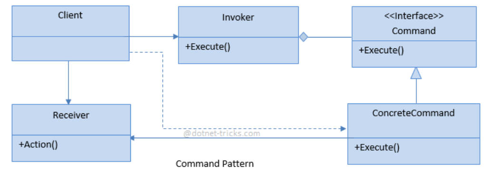

设计模式、对象池、ECS

<!-- more -->

# 设计模式

## 更好的单例模式

我们可能会用到多个单例类，对于每个单例类都写上那么一段单例模式代码实在不是很优雅。 我们可以创建一个通用的单例类，并让每个真正用到的单例类继承自它就好了！

```c#
public class Singleton<T> where T : class, new()
{
 	protected Singleton() {}
	 private static T _inst = null;
 	public static T instance => _inst ?? (_inst = new T());
    //??运算符：a??b是一种简写方法，等价于a!=null?a:b,即a不为null时返回a，否则返回b
    //可以直接使用lambda表达式来创建getter
 	public static void Clear()
	{
	 	_inst = null;
 	}
}
```

缺点：有时一个全局的访问点可能并不是好事，因为这样会增加类之间的耦合度，降低可读性，提高出错率。其实很多时候我们可以使用static字段与方法来代替单例；当我们过度使用单例时，每当一个单例类出错，很可能会导致整个系统崩溃。

## 指令模式 Command Pattern

将我们的每一个操作抽象成一个指令，并给每个指令一个“撤销”的操作。

『解耦』、『撤销功能』

```c#
public interface ICommand//公共的指令接口
{
	void Execute();
	void Undo();
}
public class ConcreteCommand : ICommand
    //每一个实际的指令都是一个继承自Icommand接口的类。执行该指令时调用Execute方法，撤销时调用Undo方法。
{
	public void Execute()//执行指令
    {
	···
	}
	public void Undo()//撤销指令
    {
	···
 	}
}
```



- **（1）指令接口（Command Interface）** 
- **（2）指令类（Concrete Command）** 
- （3）调用者（Invoker）：用来存储、调用指令，类似一个“Manager” 
- （4）接收者（Receiver）：用来真正实现一个指令 
- **（5）使用者（Client）：我们在这里创建指令并执行它们**

## 工厂模式 Factory Pattern

```c#
public abstract class Animal
{
	public abstract string Speak();
}
public class Dog : Animal
{
    public override string Speak()
    {
    return "Woof";
	}
}
public class Cat : Animal
{
    public override string Speak()
    {
    return "Meow";
    }
}
//工厂类
public static class AnimalFactory
{
     public static Animal CreateAnimal(string type)
     {
         switch (type)
         {
             case "Dog":
             return new Dog();
             case "Cat":
             return new Cat();
             default:
             throw new NotSupportedException();
         }
     }
}
//将工厂继续抽象，得到一个生成工厂的接口，原本的工厂只能生产单一的物品，比如我要生成黑猫和白猫的话就很麻烦
public interface IAnimalFactory//这样可以得到多个工厂
{
     Dog CreateDog();
     Cat CreateCat();
}
public class AnimalFactory : IAnimalFactory//真正的工厂类继承自工厂接口
{
    public Dog CreateDog()
    {
    return new Dog();
	}
 
	public Cat CreateCat()
    {
	return new Cat();
	}
}
```

# 对象池 Object Pool

是为了优化性能，如果一个GO频繁被实例化和Destroy掉，会产生大量的GC垃圾,而如果把本该销毁的GO改为enable，将其移动到屏幕之外，到再次需要启用时候，仅仅只进行坐标变换，那么消耗的性能会大大减少。

下面是一个简单的对象池

```c#
public class ObjectPool : MonoBehaviour
{
    public GameObject objectToPool; 
    public int initialPoolSize = 10; 
    private List<GameObject> pool;
    void Start()
    {
        pool = new List<GameObject>();
        for (int i = 0; i < initialPoolSize; i++)
        {
        GameObject obj = Instantiate(objectToPool);
        obj.SetActive(false);
        pool.Add(obj);
        }
    }
    public GameObject Get()
    {
        for (int i = 0; i < pool.Count; i++)
        {
            if (!pool[i].activeInHierarchy)
            {
            return pool[i];
            }
        }
        GameObject obj = Instantiate(objectToPool);
        obj.SetActive(false);
        pool.Add(obj);
        return obj;
    }
    public void ReturnToPool(GameObject obj)
    {
   		obj.SetActive(false);
    }
}
```

# ECS（Entity、Component、System）模式

这是一种面向数据的编程范式，可以获得更高的内存效能和更好的代码并行性。

Entity 实体 和GameObject类似，entity是一个有ID的物体，其中有且只有一系列的component。 

Component组件和Unity中的component不同，ECS中的component只不过是一些数据结构。它们提供了物体执行逻辑时所需要的数据。 使用Unity中的component时，我们一般不会使用它所以得功能，所以造成了性能浪费。

System系统System是真正完成物体逻辑的部分。一个system会在所有有特定component的entity上执行操作。（比如一个Render System可能会在所有有sprite renderer组件的物体上执行渲染操作）

```c#
//eg.
class Position 
{
    public float x;
    public float y;
}
class Velocity 
{
    public float dx;
    public float dy;
}
class Entity 
{
    public string id;
    public Position position;
    public Velocity velocity;
}
class MovementSystem 
{
    public void Update(Entity entity, float deltaTime) 
    {
        if(entity.position != null && entity.velocity != null)
        {
            entity.position.x += entity.velocity.dx * deltaTime;
            entity.position.y += entity.velocity.dy * deltaTime;
        }
    }
}
```

